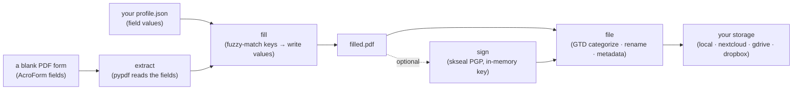
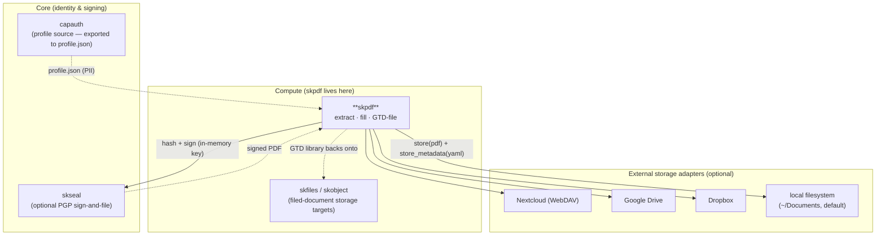

# skpdf — Sovereign PDF Form Filler 🐧

> **Send a PDF form. Get it back filled from a profile you control. File it where it belongs.**
> Extract every field, auto-fill from a JSON profile, optionally PGP-sign it, and
> file it into a GTD-organized library on your own storage — local, Nextcloud,
> Drive, or Dropbox. No SaaS, no upload-to-someone-else's-cloud.

skpdf is the **PDF document capability** of the [SKWorld](https://skworld.io)
sovereign agent ecosystem. It is a small, honest tool: a `pypdf`-based AcroForm
engine wrapped in a `click` CLI and a clean Python API, with a GTD filer and
pluggable storage backends. Your data is a JSON profile you own (today, exported
from a CapAuth profile); the filled PDF lands on storage you own.

---

## The 60-second version



You give it a form and a profile. It fills what it can match, reports what it
skipped, and (if you ask) files the result into a dated, categorized GTD folder
with a YAML metadata sidecar.

---

## Quickstart

```bash
pip install -e .                      # installs the `skpdf` CLI (entry point: skpdf.cli:cli)

# 1. See what fields a form has
skpdf extract acro_form.pdf                          # pretty table
skpdf extract acro_form.pdf --format json -o fields.json

# 2. Fill it from a JSON profile (keys → field names, fuzzy-matched)
skpdf fill acro_form.pdf --profile chef_profile.json -o filled.pdf

# 3. Fill AND file in one shot
skpdf fill acro_form.pdf -p chef_profile.json --file-to local

# 4. File an already-filled PDF into the GTD library
skpdf file filled.pdf --to local --category medical --status waiting-for --source "Blue Cross"
```

A profile is just JSON — keys are matched to PDF field names after normalization
(lowercase, strip spaces/`_`/`-`/`.` and common XFA prefixes like `form1[0].`):

```json
{
  "Given Name Text Box": "David",
  "Family Name Text Box": "Knestrick",
  "Address 1 Text Box": "8 Linden St",
  "City Text Box": "Norwalk",
  "Driving License Check Box": true,
  "Gender List Box": "Man"
}
```

Booleans drive checkboxes (the writer discovers each checkbox's real "on" state —
`/Yes`, `/On`, `/1`, …); everything else is written as text.

---

## What's in the box

| Piece | Module | What it does |
|---|---|---|
| **Extractor** | `skpdf.extractor` | Reads AcroForm fields via `pypdf` — name, type (text/checkbox/radio/dropdown/signature), value, dropdown options, required flag |
| **Filler** | `skpdf.filler` | Fuzzy-matches profile keys to field names, writes values, resolves real checkbox on-states, writes the output PDF |
| **GTD filer** | `skpdf.gtd_filer` | Auto-categorizes (keyword scan over filename + fields), generates `YYYY-MM-DD_desc_source.pdf` names, builds the GTD folder path, flags sensitive fields, emits a YAML metadata sidecar |
| **Storage** | `skpdf.storage` | `StorageBackend` ABC + `local` / `nextcloud` (WebDAV) / `gdrive` / `dropbox` adapters, plus a `get_backend()` factory |
| **SKSeal bridge** | `skpdf.skseal_bridge` | Optional `sign_and_file` / `fill_sign_and_file` — PGP-sign the filled PDF via `skseal` (private key used in memory only), then file it |
| **Models** | `skpdf.models` | Pydantic models: `PDFField`, `ExtractionResult`, `FillResult`, `PDFMetadata`, `FilingResult`, and the `FieldType` / `GTDStatus` / `Category` enums |
| **CLI** | `skpdf.cli` | `click` commands: `extract`, `fill`, `file` (with `rich` tables) |
| **JS shim** | `index.js`, `bin/cli.js` | Thin `@smilintux/skpdf` Node wrapper that shells out to the Python `skpdf` CLI |

### GTD filing, concretely

A filed PDF (default status `reference`) lands as:

```
<root>/@Reference/<Category>/<YYYY>/<YYYY-MM-DD>_<description>_<source>.pdf
<root>/@Reference/<Category>/<YYYY>/<YYYY-MM-DD>_<description>_<source>.meta.yml
```

`<root>` is the backend root (LocalBackend defaults to `~/Documents`). GTD status
maps to the top folder — `@Inbox`, `@Action/Next-Actions`, `@Action/Waiting-For`,
`@Reference`, `@Projects`, `@Archive`. Categories are auto-detected from keyword
hits (medical / financial / legal / housing / vehicle / government / personal /
uncategorized). The `.meta.yml` sidecar records category, source, status,
fill stats, `sensitive_fields` (SSN / account / routing / DOB patterns), and tags.

---

## Where it lives in SKStack v2

skpdf is a **Compute**-tier capability — a document-processing tool. It does not
run a daemon or own infrastructure; it reads a profile, processes a PDF, and writes
to storage. The platform pieces it actually touches are the ones below; everything
else is optional and adapter-gated.



- **capauth** — the long-term source of the PII profile. Today skpdf consumes a
  plain `profile.json`; the intended flow is to export it from a CapAuth profile so
  identity stays sovereign and the export is the only thing that leaves the vault.
- **skseal** — optional. If installed, `skpdf.skseal_bridge.sign_and_file()` hashes
  the filled PDF and signs it with your PGP key (key material lives in memory only;
  only the signature is persisted), then files it.
- **storage adapters** — `local` is built in; `nextcloud`/`gdrive`/`dropbox` are
  real implementations behind extras (`pip install skpdf[nextcloud]`, `[gdrive]`,
  `[dropbox]`). The local-filesystem GTD library is what `skfiles`/`skobject` would
  back in a larger deployment.

See **[docs/ARCHITECTURE.md](docs/ARCHITECTURE.md)** for the full data flow, the
checkbox-state resolution, the GTD filing lifecycle, and the source map.

---

## Status

Alpha (`0.2.0`). Implemented and tested today: AcroForm extract/fill, fuzzy key
matching, checkbox on-state resolution, GTD categorization + naming + metadata,
the storage backends, and the SKSeal sign-and-file bridge. **Not** implemented
(despite older notes you may find): OCR, XFA forms, a template library, a SKChat
plugin, and interactive question prompting — `fill` is non-interactive and simply
reports which fields it could not match.

## Install extras

```bash
pip install -e ".[dev]"        # pytest, black, ruff
pip install -e ".[nextcloud]"  # requests (WebDAV)
pip install -e ".[gdrive]"     # google-api-python-client
pip install -e ".[dropbox]"    # dropbox SDK
```

Run the tests: `pytest` (suite covers extractor, filler, models, gtd_filer,
storage, and the skseal bridge).

---

Part of the **[SKWorld](https://skworld.io)** sovereign ecosystem · 🐧 smilinTux ·
GPL-3.0-or-later
