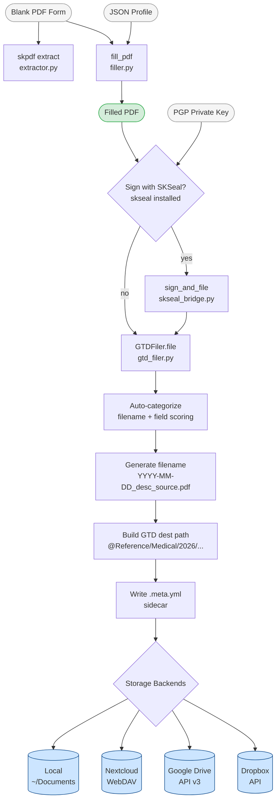

# skpdf

[](https://pypi.org/project/smilin-pdf/)
[](https://www.npmjs.com/package/@smilintux/skpdf)
[](https://www.gnu.org/licenses/gpl-3.0)
[](https://www.python.org/downloads/)

**skpdf** is a sovereign-stack PDF toolkit that extracts AcroForm fields from PDF files, auto-fills them from a JSON profile, and files the results into a GTD-organized archive — on your local filesystem or across cloud backends (Nextcloud, Google Drive, Dropbox). It integrates with [skseal](https://github.com/smilinTux/skseal) for client-side PGP signing before filing, completing a fill → sign → file pipeline entirely under your control.

---

## Install

### Python (CLI + library)

```bash
pip install smilin-pdf
```

With optional storage backends:

```bash
# Nextcloud WebDAV
pip install "smilin-pdf[nextcloud]"

# Google Drive
pip install "smilin-pdf[gdrive]"

# Dropbox
pip install "smilin-pdf[dropbox]"

# All backends + dev tools
pip install "smilin-pdf[nextcloud,gdrive,dropbox,dev]"
```

### npm (JavaScript wrapper)

```bash
npm install @smilintux/skpdf
# or
npx @smilintux/skpdf --help
```

---

## Architecture



### Module map

| Module | Responsibility |
|---|---|
| `extractor.py` | Reads AcroForm fields via `pypdf`; returns typed `PDFField` objects |
| `filler.py` | Fills AcroForm fields from a JSON profile with fuzzy key normalization |
| `gtd_filer.py` | Auto-categorizes documents, generates standardized filenames, writes YAML sidecars, dispatches to storage backends |
| `storage.py` | `StorageBackend` ABC + `Local`, `NextcloudWebDAV`, `GoogleDrive`, `Dropbox` implementations |
| `skseal_bridge.py` | Chains `fill_pdf` → PGP sign (via `skseal`) → `GTDFiler.file` in one call |
| `models.py` | Pydantic v2 models: `PDFField`, `ExtractionResult`, `FillResult`, `FilingResult`, `PDFMetadata` |
| `cli.py` | Click CLI entry points: `skpdf extract`, `skpdf fill`, `skpdf file` |

---

## Features

- **AcroForm field extraction** — enumerates text, checkbox, radio, dropdown, and signature fields with type detection, current values, and dropdown option lists
- **JSON-profile auto-fill** — maps profile keys to form fields with fuzzy normalization (strips `form1[0].` / `topmostsubform[0].` prefixes, collapses separators); fills across all pages
- **GTD filing system** — organizes documents into `@Inbox`, `@Action`, `@Reference`, `@Projects`, `@Archive` hierarchy with per-category subdirectories by year
- **Auto-categorization** — scores filename and extracted field content against per-category keyword tables to determine the filing folder without user input
- **Standardized filenames** — generates `YYYY-MM-DD_description_source.pdf` on filing
- **YAML metadata sidecars** — writes `.meta.yml` alongside every filed PDF recording category, GTD status, source, fill stats, sensitive field list, tags, and audit provenance
- **Sensitive field detection** — flags fields matching patterns such as SSN, account numbers, routing numbers, passport numbers, and date of birth
- **Multi-backend filing** — file to any combination of backends simultaneously; individual backend failures are logged and skipped without aborting the pipeline
- **SKSeal integration** — optional PGP signing of the PDF hash (via `skseal`) before filing; private key used in memory only, never written to disk
- **Rich CLI output** — color-coded tables and progress messages via `rich`
- **Fully typed** — Pydantic v2 models throughout; Python 3.10+

---

## Usage

### CLI

#### Extract form fields

```bash
# Print a Rich table of all fields
skpdf extract tax_form.pdf

# Output as JSON to stdout
skpdf extract form.pdf --format json

# Save JSON to file
skpdf extract form.pdf --format json --output fields.json
```

Example table output:

```
 Fields in tax_form.pdf (5)
┌────────────────┬───────────┬─────────┬──────────┐
│ Name           │ Type      │ Value   │ Required │
├────────────────┼───────────┼─────────┼──────────┤
│ FirstName      │ text      │         │ Yes      │
│ LastName       │ text      │         │ Yes      │
│ SSN            │ text      │         │ Yes      │
│ FilingStatus   │ dropdown  │         │          │
│ Signature      │ signature │         │          │
└────────────────┴───────────┴─────────┴──────────┘
```

#### Fill a form from a JSON profile

```bash
# Fill and write <form>_filled.pdf alongside the original
skpdf fill tax_form.pdf --profile my_info.json

# Specify output path
skpdf fill form.pdf -p profile.json -o filled_form.pdf

# Fill and immediately file to local GTD archive
skpdf fill form.pdf -p profile.json --file-to local

# Fill and file to multiple backends
skpdf fill form.pdf -p profile.json --file-to local --file-to nextcloud

# Set GTD status and document source
skpdf fill claim.pdf -p profile.json --file-to local \
    --status waiting-for --source "Blue Cross"
```

#### File a PDF to GTD storage

```bash
# File to local ~/Documents (default)
skpdf file claim_form_filled.pdf

# File to local + Nextcloud, override category
skpdf file tax_1099.pdf --to local --to nextcloud --category financial

# File with GTD status, source, and extra tags
skpdf file contract.pdf --status waiting-for --source "Acme Corp" \
    --tag signed --tag 2026

# File to a subcategory
skpdf file medical_form.pdf --category medical --subcategory insurance
```

**GTD status values:** `inbox`, `action`, `waiting-for`, `reference` *(default)*, `project`, `archive`

---

### JSON profile format

A profile is a flat JSON object mapping field names (or normalized equivalents) to string values:

```json
{
  "FirstName": "Jane",
  "LastName": "Doe",
  "SSN": "123-45-6789",
  "FilingStatus": "Single",
  "TaxYear": "2025",
  "form1[0].Address[0]": "123 Main St"
}
```

Keys are normalized before matching: lowercased, common PDF prefixes stripped (`form1[0].`, `topmostsubform[0].`, `page1[0].`), and all separators (`_`, `-`, `.`, space) removed. This means `"FirstName"`, `"first_name"`, and `"form1[0].FirstName[0]"` all resolve to the same slot.

---

### Python API

#### Extract fields

```python
from skpdf import extract_fields

result = extract_fields("tax_form.pdf")
print(f"Found {result.total_fields} fields in {result.filename}")

for field in result.fields:
    print(f"  {field.name!r:30s}  type={field.field_type.value}  "
          f"value={field.value!r}  required={field.required}")
    if field.options:
        print(f"    options: {field.options}")
```

#### Fill a form

```python
from skpdf.filler import fill_pdf

result = fill_pdf(
    pdf_path="blank_form.pdf",
    profile_path="profile.json",
    output_path="filled_form.pdf",   # optional; defaults to <input>_filled.pdf
)
print(f"Filled {result.fields_filled}/{result.fields_total} fields "
      f"({result.fields_skipped} skipped)")
print(f"Output: {result.output_path}")
```

#### File a PDF to GTD storage

```python
from pathlib import Path
from skpdf import GTDFiler
from skpdf.storage import LocalBackend, NextcloudWebDAVBackend

filer = GTDFiler(backends=[
    LocalBackend(),                          # ~/Documents by default
    NextcloudWebDAVBackend(
        base_url="https://cloud.example.com/remote.php/dav/files/me/",
        username="me",
        password="app-token",
    ),
])

result = filer.file(
    pdf_path=Path("claim_form_filled.pdf"),
    source="Blue Cross",
    gtd_status="reference",
    tags=["insurance", "2026"],
)

print(result.category)       # "medical"   (auto-detected)
print(result.path)           # ~/Documents/@Reference/Medical/2026/2026-03-04_...pdf
print(result.metadata_path)  # ~/Documents/@Reference/Medical/2026/2026-03-04_...meta.yml
print(result.destinations)   # ["local:@Reference/...", "nextcloud:@Reference/..."]
```

#### Fill + sign + file (sovereign pipeline)

```python
from skpdf.skseal_bridge import fill_sign_and_file
from skpdf import GTDFiler
from skpdf.storage import NextcloudWebDAVBackend

with open("my_pgp_private.asc") as f:
    private_key = f.read()

result = fill_sign_and_file(
    blank_pdf_path="blank_form.pdf",
    profile_path="profile.json",
    signer_name="Jane Doe",
    signer_email="jane@example.com",
    private_key_armor=private_key,
    passphrase="my-passphrase",
    filer=GTDFiler(backends=[NextcloudWebDAVBackend(
        base_url="https://cloud.example.com/remote.php/dav/files/me/",
        username="me",
        password="app-token",
    )]),
    source="Blue Cross",
    tags=["claim"],
)

print(result.document_id)      # SKSeal document UUID
print(result.fingerprint)      # PGP key fingerprint
print(result.signed_at)        # ISO-8601 timestamp
print(result.filing.path)      # Final destination path
print(result.signature_armor)  # ASCII-armored PGP signature
```

---

## GTD Folder Structure

Documents filed under `reference` status land at:

```
~/Documents/
├── @Inbox/
├── @Action/
│   ├── Next-Actions/
│   └── Waiting-For/
├── @Reference/
│   ├── Financial/
│   │   └── 2026/
│   │       ├── 2026-03-04_tax-1099_irs.pdf
│   │       └── 2026-03-04_tax-1099_irs.meta.yml
│   ├── Medical/
│   │   └── 2026/
│   ├── Legal/
│   ├── Housing/
│   ├── Vehicle/
│   ├── Government/
│   └── Personal/
├── @Projects/
└── @Archive/
```

`action`, `waiting-for`, `project`, and `archive` statuses route to their own top-level folders. Metadata sidecar example:

```yaml
original_filename: BC_Claim_Form_2026.pdf
filed_date: '2026-03-04T14:30:00'
category: medical
subcategory: insurance
source: Blue Cross
status: waiting-for
follow_up_date: null
fields_filled: 12
fields_auto: 12
fields_manual: 0
sensitive_fields:
  - SSN
  - PolicyNumber
filed_by: skpdf
filed_to:
  - local:@Reference/Medical/2026/2026-03-04_bc-claim-form-2026_blue-cross.pdf
tags:
  - medical
  - insurance
  - '2026'
  - blue-cross
```

---

## Configuration

### Storage backends

| Backend | Class | Extra required | Key parameters |
|---|---|---|---|
| Local filesystem | `LocalBackend` | *(none)* | `root` — default `~/Documents` |
| Nextcloud WebDAV | `NextcloudWebDAVBackend` | `[nextcloud]` | `base_url`, `username`, `password` |
| Google Drive | `GoogleDriveBackend` | `[gdrive]` | `credentials_path` (service account JSON), `root_folder_id` |
| Dropbox | `DropboxBackend` | `[dropbox]` | `access_token`, `root_path` — default `/Documents` |

Use the `get_backend()` factory for configuration-driven instantiation:

```python
from skpdf.storage import get_backend

backend = get_backend("nextcloud",
    base_url="https://cloud.example.com/remote.php/dav/files/me/",
    username="me",
    password="app-token",
)
```

### Auto-categorization

`GTDFiler.categorize()` scores the PDF filename and all extracted field names/values against keyword lists. You can always override with `--category` on the CLI or `category=` in the Python API.

| Category | Triggered by (sample keywords) |
|---|---|
| `medical` | insurance, doctor, hospital, pharmacy, health, copay, deductible, Blue Cross, Aetna |
| `financial` | tax, bank, 1099, w-2, irs, mortgage, dividend, 401k, routing, account number |
| `legal` | contract, agreement, court, attorney, will, notary, affidavit, settlement |
| `housing` | lease, rent, utility, hoa, landlord, tenant, property, inspection |
| `vehicle` | dmv, registration, title, vin, odometer, emission, smog |
| `government` | ssa, passport, social security, citizenship, permit, voter |
| `personal` | school, employment, certificate, transcript, birth, marriage, diploma |

### Sensitive field detection

Fields whose names match these patterns are listed in `sensitive_fields` in the `.meta.yml` sidecar (never redacted in the PDF itself — flagged for audit awareness only):

`ssn`, `social_security`, `tax_id`, `ein`, `policy_number`, `account_number`, `routing_number`, `credit_card`, `passport_number`, `driver_license`, `dob` / `date_of_birth`

---

## Development

### Setup

```bash
git clone https://github.com/smilinTux/skpdf.git
cd skpdf
python -m venv .venv && source .venv/bin/activate
pip install -e ".[dev]"
```

### Tests

```bash
pytest
pytest --cov=skpdf --cov-report=term-missing
```

### Lint & format

```bash
ruff check src/
black src/
```

### Build

```bash
pip install build
python -m build
```

### Project structure

```
skpdf/
├── src/skpdf/
│   ├── __init__.py          # Public API + version (0.2.0)
│   ├── cli.py               # Click CLI: extract, fill, file
│   ├── extractor.py         # AcroForm field extraction
│   ├── filler.py            # JSON-profile form filling
│   ├── gtd_filer.py         # GTD categorization & filing
│   ├── models.py            # Pydantic models
│   ├── skseal_bridge.py     # fill → sign → file integration
│   └── storage.py           # Storage backend implementations
├── tests/
├── pyproject.toml
└── package.json
```

### Contributing

1. Fork the repository
2. Create a feature branch: `git checkout -b feat/my-feature`
3. Write code and tests
4. Run `ruff check src/ && black src/ && pytest`
5. Open a pull request against `main`

Report bugs and request features at [github.com/smilinTux/skpdf/issues](https://github.com/smilinTux/skpdf/issues).

---

## License

GPL-3.0-or-later © [smilinTux.org](https://smilintux.org)
