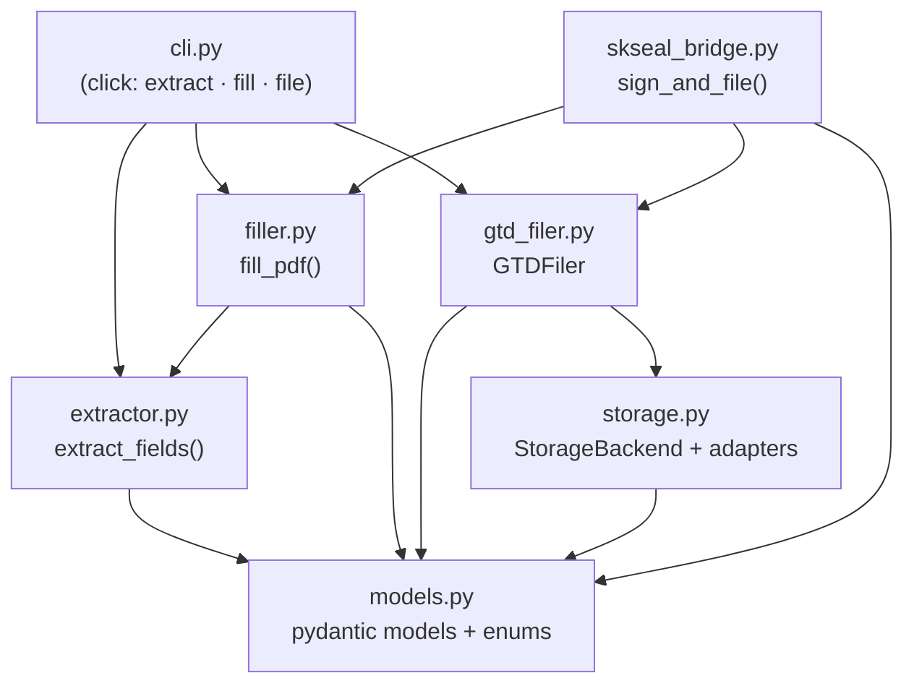
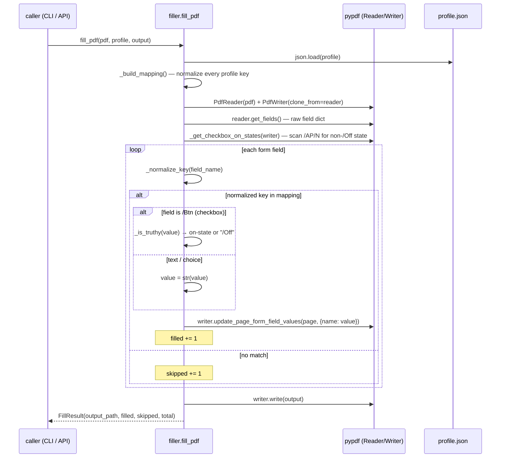
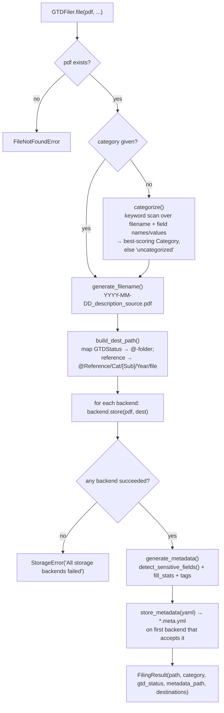
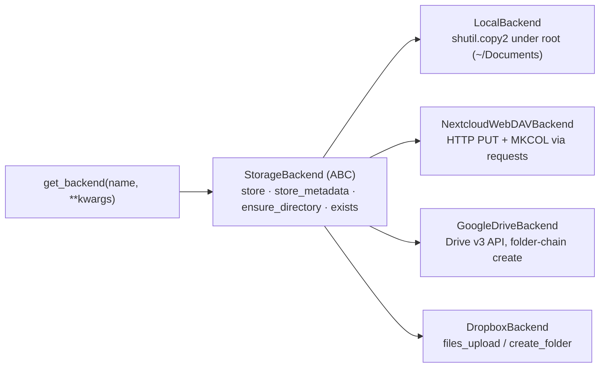
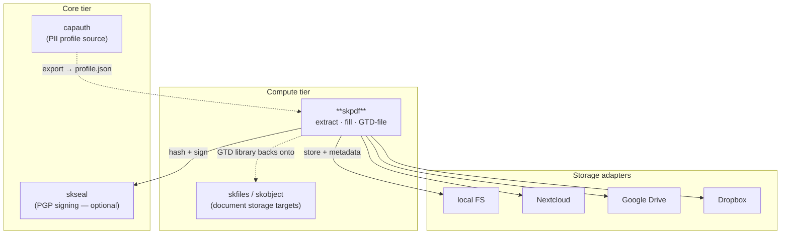

# skpdf — Architecture

skpdf is a small, library-first PDF form tool. There is no daemon, no server, and
no background state: every operation is a pure function over a PDF, an optional
JSON profile, and a storage target. This document describes how the pieces fit,
the two key workflows (fill and file), and where each line of behavior lives in the
source.

The guiding constraints, read straight from the code:

1. **AcroForm-only.** Extraction and filling go through `pypdf`'s form API. There
   is no OCR, no XFA, and no flat-PDF field detection — those are explicitly *not*
   present (see [Non-goals](#non-goals)).
2. **Profile is plain JSON, matched fuzzily.** Keys are normalized and compared to
   normalized field names; types are preserved (a `bool` drives a checkbox, a string
   is written as text).
3. **Filing is GTD-shaped and reversible.** Every filed PDF is renamed by a fixed
   convention, placed in a GTD folder, and shadowed by a human-readable YAML
   metadata sidecar.
4. **Storage is ports/adapters.** A `StorageBackend` ABC defines `store` /
   `store_metadata` / `ensure_directory` / `exists`; `local`, `nextcloud`,
   `gdrive`, and `dropbox` are adapters.
5. **Signing is optional and out-of-process for keys.** The SKSeal bridge imports
   `skseal` lazily; the private key is used in memory and never persisted.

---

## Component map



`models.py` is the shared vocabulary every other module speaks. `cli.py` is a thin
orchestration layer; the real logic is in `extractor`, `filler`, `gtd_filer`, and
`storage`.

---

## Source map

| Module | Role | Key entry points |
|---|---|---|
| `skpdf/models.py` | Data contracts: `FieldType`, `GTDStatus`, `Category` enums; `PDFField`, `ExtractionResult`, `FillResult`, `PDFMetadata`, `FilingResult` | (pydantic models) |
| `skpdf/extractor.py` | Read AcroForm fields with `pypdf`; detect type from `/FT`, options from `/Opt`, required from `/Ff` bit 2 | `extract_fields(pdf_path)` |
| `skpdf/filler.py` | Normalize + fuzzy-match profile keys to fields, resolve checkbox on-states, write the filled PDF | `fill_pdf(pdf, profile, output)` |
| `skpdf/gtd_filer.py` | Categorize, name, build GTD path, detect sensitive fields, emit YAML metadata, store via backends | `GTDFiler.file(...)`, `.categorize()`, `.generate_filename()`, `.build_dest_path()` |
| `skpdf/storage.py` | `StorageBackend` ABC + `LocalBackend`, `NextcloudWebDAVBackend`, `GoogleDriveBackend`, `DropboxBackend`; `get_backend()` factory; `StorageError` | `backend.store()`, `backend.store_metadata()` |
| `skpdf/skseal_bridge.py` | Optional PGP sign-then-file wiring to `skseal` | `sign_and_file(...)`, `fill_sign_and_file(...)` |
| `skpdf/cli.py` | `click` CLI: `extract`, `fill`, `file`; `rich` output | `cli()` (console script `skpdf`) |
| `index.js` / `bin/cli.js` | `@smilintux/skpdf` Node shim that shells out to the Python CLI | `run(args)`, `skpdf-js` bin |

---

## Workflow 1 — extract and fill

`fill_pdf()` is the heart of the tool. The non-obvious work is *matching* profile
keys to PDF field names (which are often verbose, prefixed, or inconsistently
cased) and *resolving* the correct "on" appearance state for each checkbox.



### Key normalization (`filler._normalize_key`)

A field name is lowercased, stripped, has known XFA container prefixes removed
(`form1[0].`, `topmostsubform[0].`, `page1[0].`), and then has all of `_ - space .`
deleted. Profile keys are run through the same function, so
`"Given Name Text Box"` in the profile matches a `Given Name Text Box` field, and
`form1[0].page1[0].SSN` matches `ssn`. Matching is exact-after-normalization (no
semantic/LLM mapping).

### Checkbox state resolution (`filler._get_checkbox_on_states`)

PDF checkboxes do not all use `/Yes` for "checked"; the real on-state is whatever
non-`/Off` key appears under the widget's `/AP/N` appearance dictionary. The filler
walks every page's `/Annots`, finds `/Btn` widgets, and records each one's on-state
name. At fill time a truthy profile value becomes that state; a falsy value becomes
`/Off`. `_is_truthy` accepts Python `bool`s and the strings
`true/yes/1/on/off`-style tokens.

### Extraction (`extractor.extract_fields`)

Returns an `ExtractionResult`. For each field it maps `/FT` →
`FieldType` (`/Tx`→text, `/Btn`→checkbox, `/Ch`→dropdown, `/Sig`→signature, else
unknown), reads `/V` as the current value, pulls `/Opt` for dropdown options, and
derives `required` from `/Ff` bit 2. If the PDF has no AcroForm, it returns a
zero-field result rather than raising.

---

## Workflow 2 — file (the GTD lifecycle)

`GTDFiler.file()` takes a PDF (already filled, or any PDF) and produces a
`FilingResult` plus a YAML sidecar, stored to every configured backend.



### Categorization (`GTDFiler.categorize`)

Builds a text blob from the filename (de-slugified) plus every field name and value,
then scores each category by counting keyword hits from `CATEGORY_KEYWORDS`
(medical / financial / legal / housing / vehicle / government / personal). Highest
score wins; no hits → `uncategorized`.

### Naming (`GTDFiler.generate_filename`)

`YYYY-MM-DD` + slugified filename stem + optional slugified source, joined by `_`,
e.g. `2026-02-21_bc-claim-form_blue-cross.pdf`. Date defaults to today.

### GTD path (`GTDFiler.build_dest_path`)

GTD status selects the top folder via `GTD_FOLDERS`
(`@Inbox` / `@Action/Next-Actions` / `@Action/Waiting-For` / `@Reference` /
`@Projects` / `@Archive`). Only `reference` files get the deep
`@Reference/<Category>/[<Subcategory>/]<Year>/<file>` tree; other statuses go flat
under their `@`-folder.

### Sensitive-field detection (`GTDFiler.detect_sensitive_fields`)

Field names are matched against `SENSITIVE_PATTERNS` (regex for SSN, social
security, tax-id/EIN, policy/account/routing number, credit card, passport,
driver license, DOB). Matches are recorded in the metadata's `sensitive_fields`
so a downstream policy (or human) can decide whether to encrypt or restrict.

### Metadata sidecar (`models.PDFMetadata` → YAML)

A `.meta.yml` written next to the PDF (path = PDF path with extension swapped),
capturing `original_filename`, `filed_date`, `category`/`subcategory`, `source`,
GTD `status`, `follow_up_date`, fill counts (`fields_filled/auto/manual`),
`sensitive_fields`, `filed_by`, `filed_to` (the backend URIs), and `tags`
(auto: category, subcategory, year, source, plus any caller tags).

---

## Storage: ports and adapters



- **LocalBackend** — default; root is `~/Documents` unless overridden. Creates the
  GTD subtree with `mkdir(parents=True)` and copies the file in.
- **NextcloudWebDAVBackend** — `PUT` the file, `MKCOL` each path segment to create
  collections; metadata `PUT` as `text/yaml`. Requires `requests` (extra:
  `nextcloud`).
- **GoogleDriveBackend** — resolves/creates the folder chain, uploads via
  `MediaFileUpload`, writes metadata via `MediaInMemoryUpload`. Requires the Google
  client libs (extra: `gdrive`).
- **DropboxBackend** — `files_upload` with overwrite; folder create best-effort.
  Requires the `dropbox` SDK (extra: `dropbox`).

`get_backend()` is a name→class factory; unknown names raise `ValueError` with the
valid set. `GTDFiler.file()` tolerates partial backend failure (it logs and
continues) and only raises `StorageError` if **every** backend fails.

> Note: in the CLI today (`cli._file_pdf`), only `local` is wired to a concrete
> backend; `nextcloud`/`gdrive`/`dropbox` names fall back to `LocalBackend` with a
> warning, because they need configuration (URL/credentials) the CLI does not yet
> collect. The non-local adapters are fully implemented and usable via the Python
> API by constructing the backend directly.

---

## Workflow 3 — sign and file (optional, via SKSeal)

`skseal_bridge` is the sovereign-document path: fill → sign with your PGP key →
file. It imports `skseal` lazily, so skpdf has no hard dependency on it.

```mermaid
sequenceDiagram
    participant U as caller
    participant B as skseal_bridge
    participant FZ as filler.fill_pdf
    participant E as skseal.SealEngine
    participant G as GTDFiler

    Note over U,B: fill_sign_and_file() chains fill → sign_and_file()
    U->>FZ: fill_pdf(blank, profile, output)
    FZ-->>B: FillResult (filled.pdf + stats)
    U->>B: sign_and_file(filled.pdf, signer, key, passphrase, filer, ...)
    B->>E: hash_bytes(pdf) → pdf_hash
    B->>E: sign_document(doc, key_armor, passphrase, pdf_data)
    Note over E: private key used in memory only;<br/>only the signature is kept
    E-->>B: signed_doc (document_id, fingerprint, signature_armor)
    B->>G: filer.file(pdf, ... tags += signed, signer:<name>)
    G-->>B: FilingResult
    B-->>U: SignAndFileResult(document_id, filing, fingerprint, signed_at, signature_armor)
```

If `skseal` is not installed, `sign_and_file` raises `ImportError` with an install
hint — the plain fill/file paths are unaffected.

---

## Where it lives in the ecosystem



skpdf depends on **capauth** only as a *data source* (a profile export), and on
**skseal** only *optionally* (signing). It does not call any SK platform daemon
(no `sk-alert`, no scheduler, no coord board) — it is a leaf tool that runs
in-process and writes to whatever storage you point it at.

---

## Non-goals (explicitly not implemented)

These appear in older marketing-style notes but are **not** in the codebase, and
this architecture intentionally does not assume them:

- **OCR / scanned-paper field detection** — extraction is AcroForm-only.
- **XFA forms** — `_normalize_key` strips XFA-style prefixes, but there is no XFA
  parser; only standard AcroForm fields are read/written.
- **Template library** for known government forms.
- **Interactive question flow** — `fill` is non-interactive; unmatched fields are
  counted in `fields_skipped`, not prompted for.
- **SKChat plugin / FastAPI service** — skpdf is a CLI + library only.
- **PDF flattening / encryption / live CapAuth decryption** — the filler writes a
  normal fillable PDF; sensitive handling is limited to *flagging* sensitive field
  names in metadata.

---

## Testing

The `tests/` suite exercises each module: `test_extractor.py`, `test_filler.py`,
`test_models.py`, `test_gtd_filer.py`, `test_storage.py`, and
`test_skseal_bridge.py`. Run with `pytest` (configured via `pyproject.toml`:
`testpaths=["tests"]`, `pythonpath=["src"]`).

---

Part of the **[SKWorld](https://skworld.io)** sovereign ecosystem · 🐧 smilinTux
